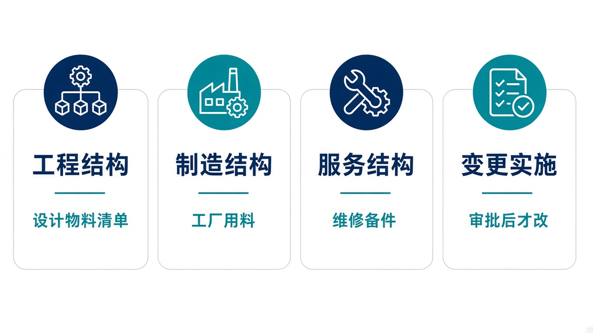
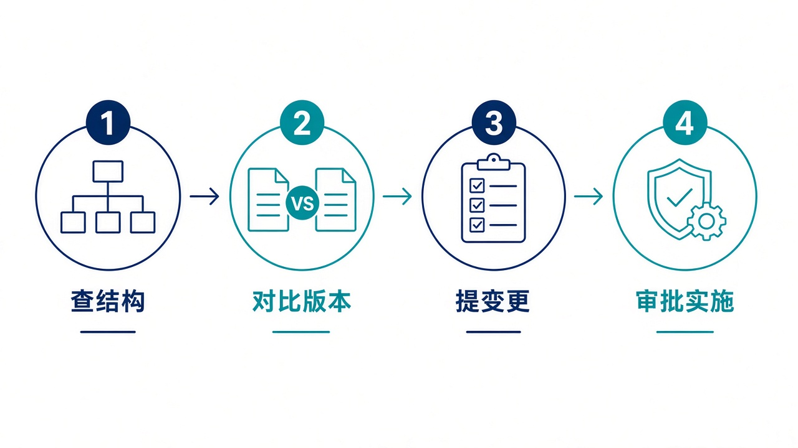

# 给大家讲：产品结构系统怎么用

BOM 管零件和三套产品结构：工程、制造、服务。工程变更先审批，通过后才改结构。控制塔可以按编号展开和推动变更，但必须带开放密钥。亮点短表见 [项目亮点](./项目亮点.md)。

## 适合什么场景

| 场景 | 在这里怎么做 |
| --- | --- |
| 设计刚发布一版物料清单 | 维护工程 BOM，和制造、服务结构分开 |
| 工厂要按工位用料 | 看制造 BOM，不要直接改工程结构 |
| 售后要知道备件结构 | 看服务 BOM |
| 结构要改 | 提工程变更，提交、审批，通过后再实施 |
| 控制塔要看某个总成拆成什么 | 按 BOM 号展开最新版本。展开本身不改结构 |

## 亮点

1. 三种结构各自有版本，不挤在一张清单里。
2. 零件能反查被哪些结构使用，也能做版本对比和配置解析。
3. 变更没有审批通过，实施不会改到目标 BOM。
4. 登录口不会悄悄改一张变更。要让控制塔操作，先配开放密钥。

## 一天怎么用

1. 按零件或 BOM 号查结构，确认看的是工程、制造还是服务。
2. 和上一版对比，看增删改了哪些行。
3. 需要改动时新建变更，不要直接改已发布结构。
4. 提交并审批。通过后实施，再核对目标 BOM。

已批准的演示变更不要和另一张变更共用同一张制造 BOM，否则会改到错误的结构。
