# BOM 零部件管理系统 项目汇报

> 面向汽车主机厂 / 工厂的零部件与产品结构管理平台。Java 8 后端 + Vue 3 前端，单 JAR 部署，合入即自动发布。
> 配套阅读：[项目亮点](./项目亮点.md) · [图文导读](./图文导读.md) · [技术方案](./技术方案.md) · [README](../README.md)

---

## 1. 项目概览

| 项目 | 内容 |
| --- | --- |
| 目标 | 建设主机厂标准的 BOM 平台：零件主数据 → EBOM / MBOM / SBOM → 工程变更（ECR/ECN）→ ERP/控制塔集成 |
| 用户 | 产品工程师、制造工程师、变更管理员、只读用户；外部系统（SAP、控制塔 IR）通过开放 API 接入 |
| 技术栈 | Java 8 · Spring Boot 2.7 · MyBatis-Plus · H2（兼容 MySQL）· Vue 3 · Element Plus · Vite |
| 交付形态 | 单 JAR / 便携包 / Linux · Windows · macOS（x64 + Apple Silicon）原生包，GitHub Actions 自动构建发布 |
| 仓库 | <https://github.com/mengzhihua/bom> |

### 1.1 建设过程

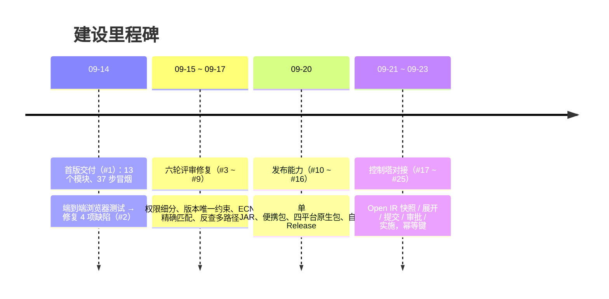

### 1.2 规模一览

| 指标 | 数值 |
| --- | --- |
| 合并 PR | 25 个（含 8 轮评审修复） |
| 后端 | 73 个 Java 文件 · 13 个 Controller · 92 个 REST 接口 · 19 张表 |
| 前端 | 23 个 Vue 页面 / 组件 |
| 自动化验证 | 单元测试 + 37 步接口冒烟 + 发布包冒烟，每次 PR 自动执行 |

---

## 2. 业务能力

### 2.1 全景

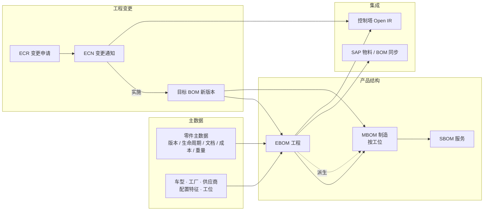

### 2.2 功能清单

| 模块 | 能力 | 状态 |
| --- | --- | --- |
| 零件主数据 | 编码 / 分类 / 材料 / 供应商 / 成本 / 重量；版本历史；DRAFT → RELEASED → OBSOLETE 生命周期；CSV 导入导出 | 已上线 |
| 车型与配置 | 车型项目、工厂、供应商、配置特征（如 ENGINE=2.0T / TRANS=AT）| 已上线 |
| BOM 管理 | EBOM / MBOM / SBOM 三种结构；多级结构树、缩排展开、汇总 BOM、成本重量汇总 | 已上线 |
| 配置 BOM | 150% 超级 BOM 按配置条件解析出 100% 结构 | 已上线 |
| 反查 / 对比 | 零件反查所有使用路径（含共享子装配多路径）；任意两版本 / 两 BOM 行级对比 | 已上线 |
| 版本管理 | BOM 版本唯一约束、升版、发布、作废；EBOM 派生 MBOM | 已上线 |
| 工位 | 工位主数据；MBOM 行按工位分配、按工位查看用料 | 已上线 |
| 工程变更 | ECR 申请 → 审批；ECN 明细 ADD / MODIFY / REMOVE / REPLACE；实施生成目标 BOM 新版本、旧版自动作废 | 已上线 |
| SAP 集成 | 物料 / BOM 同步（mock / HTTP 两种模式）、集成日志 | 已上线 |
| 控制塔 Open IR | BOM / ECN 快照；按编号展开、提交、审批、实施；`X-Api-Key` 鉴权；幂等键去重 | 已上线 |
| 系统 | 登录令牌、RBAC 四角色、用户管理、操作日志 | 已上线 |

### 2.3 核心流程：工程变更

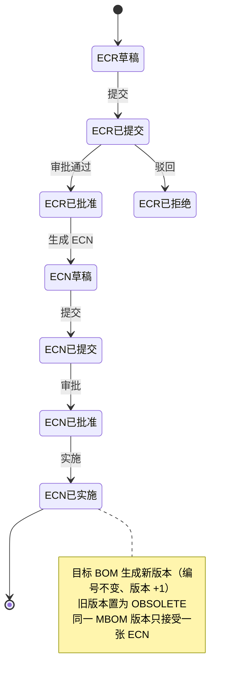

**约束**：未审批通过的变更不会触碰任何 BOM；实施是唯一修改已发布结构的途径。控制塔的写操作必须带 API Key，登录会话无法通过开放口改变更。

---

## 3. 系统架构

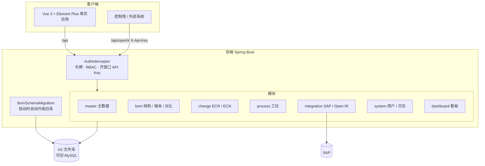

| 关注点 | 做法 |
| --- | --- |
| 权限 | 四角色 ADMIN / ENGINEER / PLANNER / VIEWER；接口按精确路径 + 方法放行只读，写操作按角色校验 |
| 数据一致性 | BOM `(bom_no, version)` 唯一约束；结构成环检测；ECN 按父件 + 子件 + 序号 + 旧配置条件精确匹配 |
| 兼容升级 | `bom_schema_version` 记录一次性迁移，旧数据库启动即自动补列、回填 |
| 可观测 | 操作日志 + 集成日志入库，工作台展示 |
| 数据目录 | 开发 `./data`；原生包 `~/.bom/data`，可用 `BOM_DATA_DIR` 覆盖，升级不丢库 |

---

## 4. 系统界面

### 登录与工作台

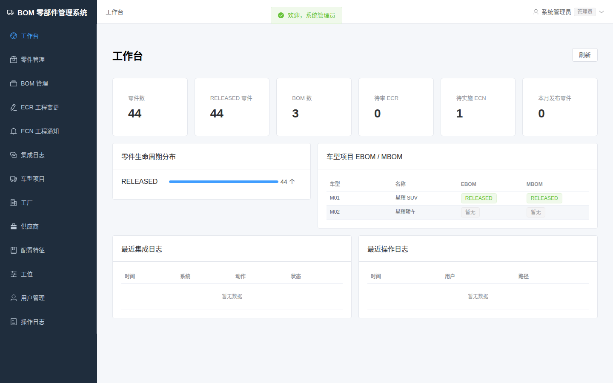

### 零件主数据

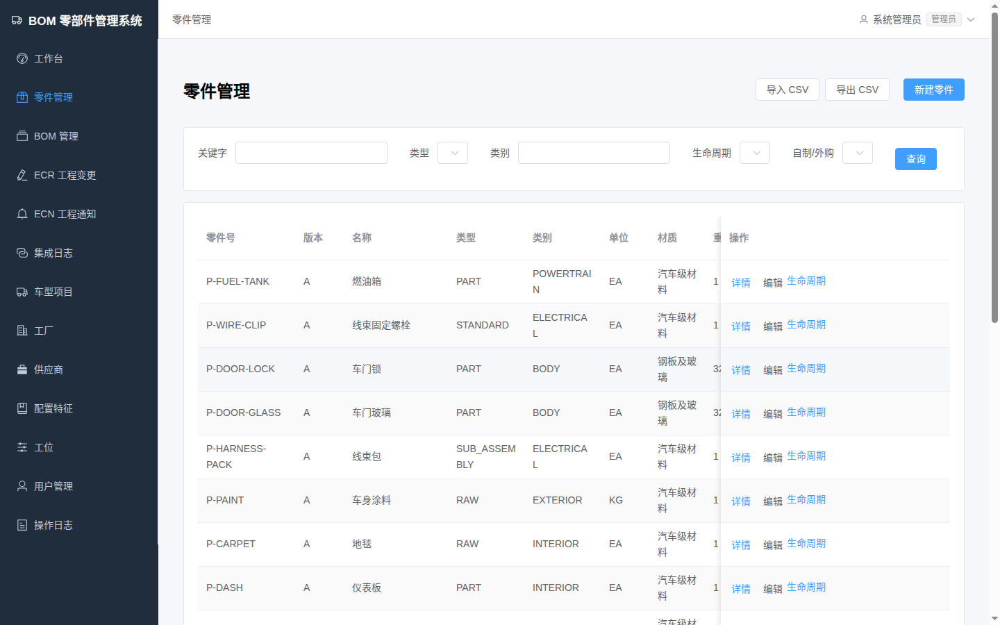

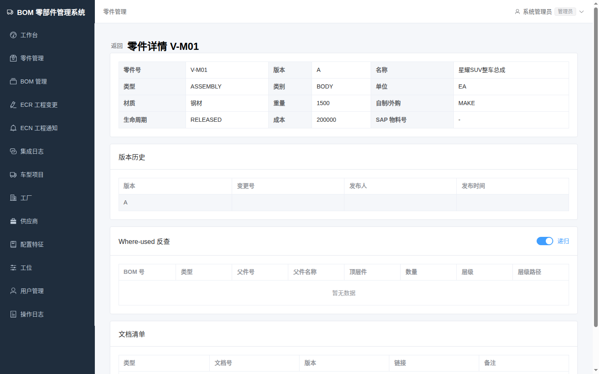

### BOM 结构

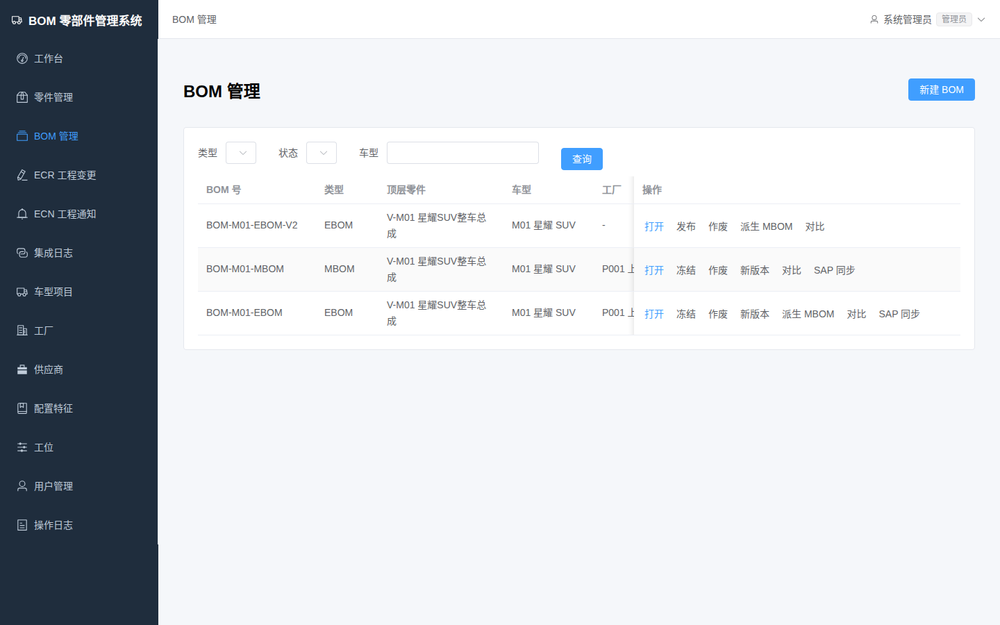

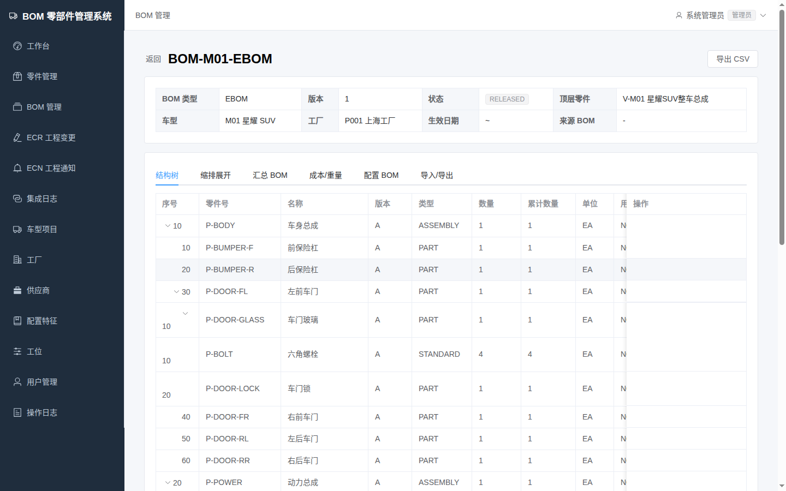

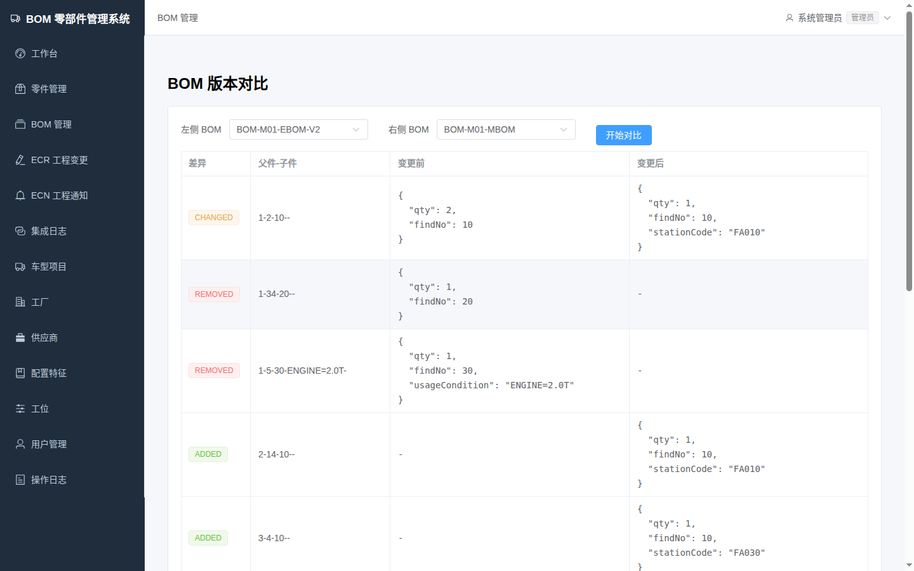

### 工程变更

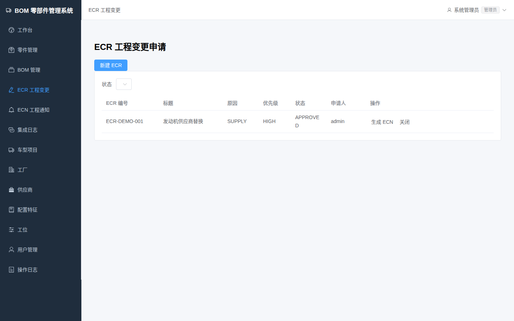

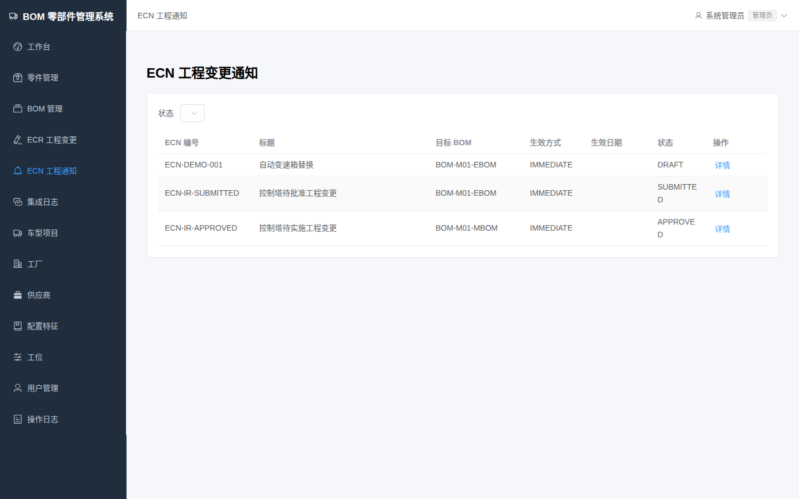

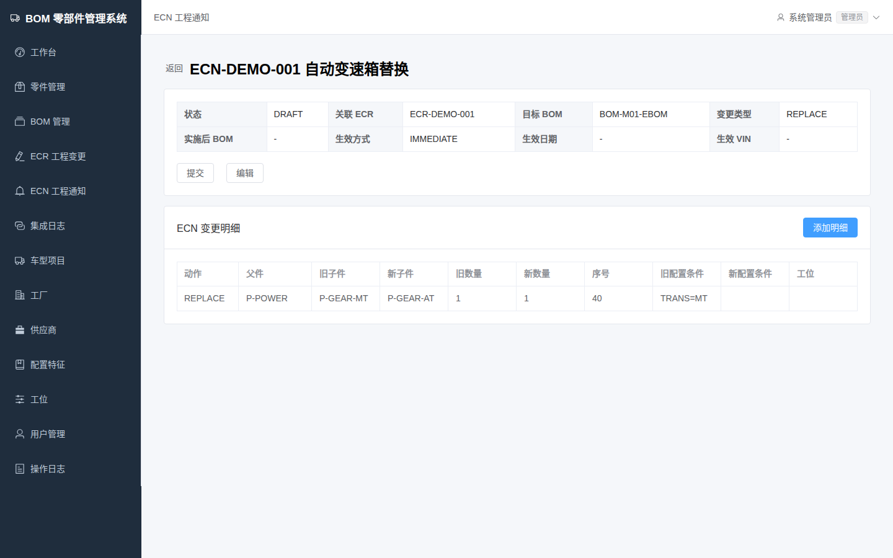

### 工位、集成与系统

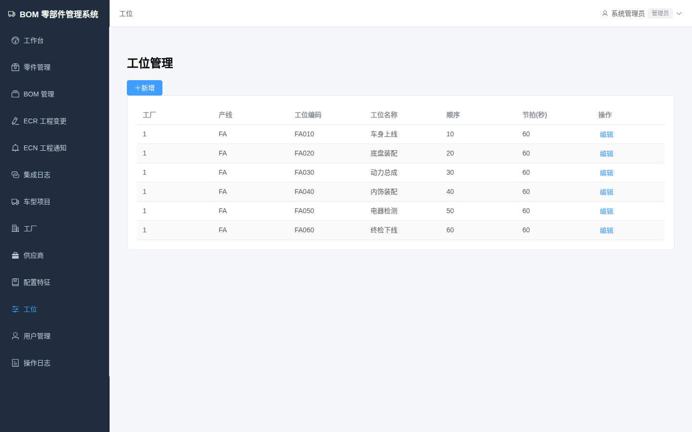

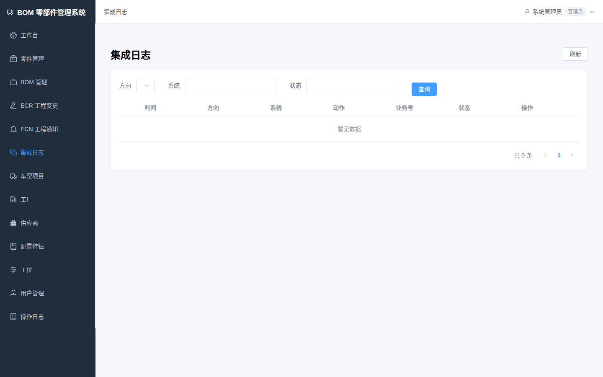

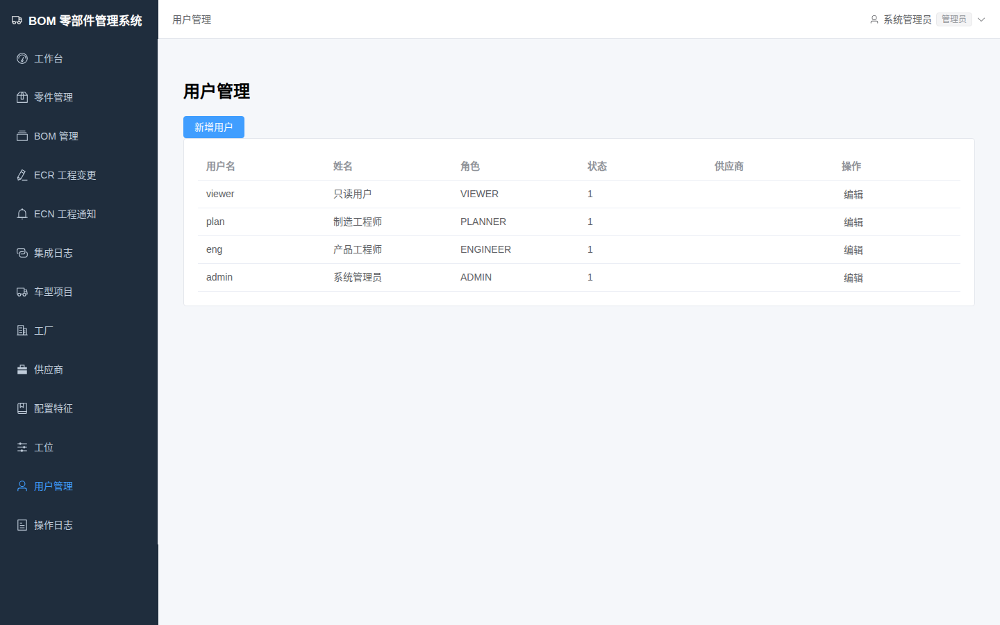

---

## 5. 交付与发布

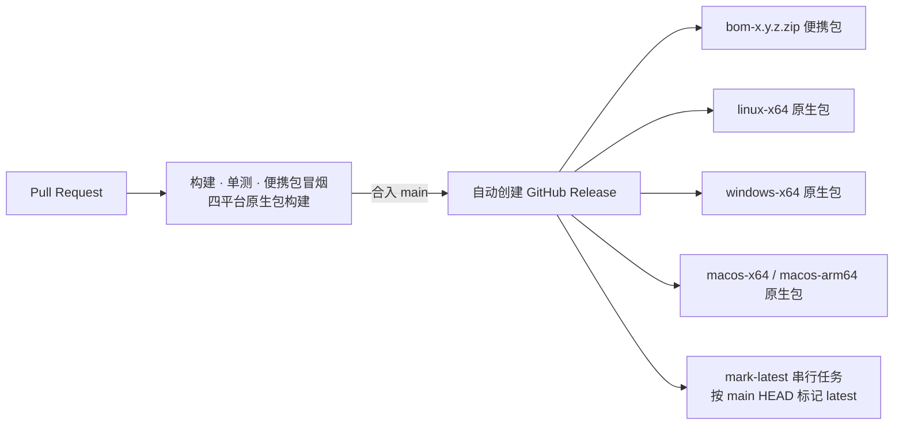

| 形态 | 依赖 | 说明 |
| --- | --- | --- |
| 服务端 JAR | JDK 17 | `java -jar`，前端已内嵌，默认 8088 |
| 便携包 | 本机 Java | 解压后 `start.sh` / `start.bat`，自带 `smoke.sh` 自检 |
| 原生包 | 无 | 捆绑 JRE，双击运行；数据落在 `~/.bom/data` |

发布地址：<https://github.com/mengzhihua/bom/releases>

---

## 6. 质量保障

| 层级 | 内容 |
| --- | --- |
| 单元测试 | 权限策略、BOM 服务等，`mvn test` 每次 PR 执行 |
| 接口冒烟 | `scripts/smoke.sh` 37 步：登录 → 零件生命周期 → 多级 BOM / 条件行 / 成环拒绝 → 展开 / 汇总 / 反查 / 配置 → 发布 / 派生 / 对比 → ECR / ECN 全流程 → SAP 同步 → 开放 API 鉴权 → 旧库迁移 |
| 发布包冒烟 | 解压真实发布包启动，验证首页、SPA 路由和登录 |
| 浏览器端到端 | 首版交付后按真实用户路径录屏测试（登录 → 零件 → BOM → 变更 → 集成 → 权限），发现 4 项缺陷并已修复 |
| 代码评审 | 每个 PR 经自动评审，累计处理 30+ 条功能性问题（权限绕过、字段清空、并发发布抢 latest 等） |

---

## 7. 已知边界与下一步

**当前边界**

- 制造执行（MES 工单、领料）不在本系统，MBOM 按工位输出供下游使用。
- 单实例 H2 文件库适合演示与中小规模；生产建议切 MySQL（配置已兼容）。
- SAP 集成为 mock + HTTP 通道，字段映射需按目标 SAP 环境调整。

**建议下一步**

| 方向 | 内容 | 预估 |
| --- | --- | --- |
| 数据库 | 切 MySQL，补 Flyway 迁移脚本 | 1 个迭代 |
| 变更协同 | ECN 多级审批流、影响分析（受影响 BOM / 工厂 / 在制订单） | 1~2 个迭代 |
| 配置管理 | 特征族 / 特征值约束规则、配置合法性校验 | 1 个迭代 |
| 集成 | SAP 真实接口对接、控制塔回调与状态回写 | 视对方接口 |
| 报表 | 成本 / 重量趋势、变更统计看板 | 1 个迭代 |
